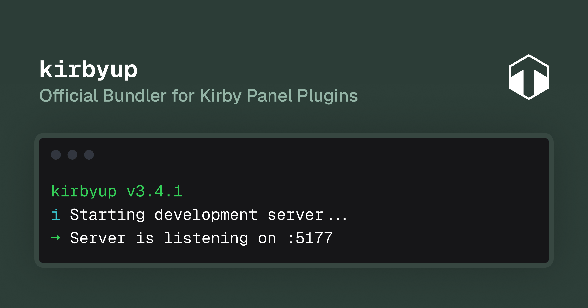

[](https://kirbyup.getkirby.com)

# kirbyup

The official bundler for Kirby Panel plugins with zero-config usage and built-in HMR.

- [✨ &nbsp;Release Notes](https://github.com/johannschopplich/kirbyup/releases)
- [📖 &nbsp;Read the documentation](https://kirbyup.getkirby.com)

## Key Features

- 🔄 [Hot module replacement](https://kirbyup.getkirby.com/guide/getting-started.html#development)
- 🎒 PostCSS support
- 🧭 Add custom path aliases
- 🔌 Run actions based on environment variables
- 🦔 [Extends Vite with `kirbyup.config.js`](https://kirbyup.getkirby.com/guide/config-file)

## Setup

> [!TIP]
> [📖 Read the documentation](https://kirbyup.getkirby.com)

```bash
# pnpm
pnpm add -D kirbyup

# npm
npm i -D kirbyup
```

## Basic Usage

> [!TIP]
> [📖 Read the documentation](https://kirbyup.getkirby.com) or skip starting from scratch and pick one of the following starters:
> - [`eslint`](./examples/eslint)
> - [`tailwindcss`](./examples/tailwindcss)

Having installed kirbyup, you can add the following scripts as shortcuts to the commands you will use most often:

```json
{
  "scripts": {
    "dev": "kirbyup serve src/index.js",
    "build": "kirbyup src/index.js"
  },
  "devDependencies": {
    "kirbyup": "^3.4.0"
  }
}
```

## 💻 Development

1. Clone this repository
2. Enable [Corepack](https://github.com/nodejs/corepack) using `corepack enable`
3. Install dependencies using `pnpm install`
4. Run `pnpm run dev:prepare`
5. Start development server using `pnpm run dev`

## License

[MIT](./LICENSE) License © 2021-PRESENT [Johann Schopplich](https://github.com/johannschopplich)

[MIT](./LICENSE) License © 2022-PRESENT [Jonas Kuske](https://github.com/jonaskuske)
