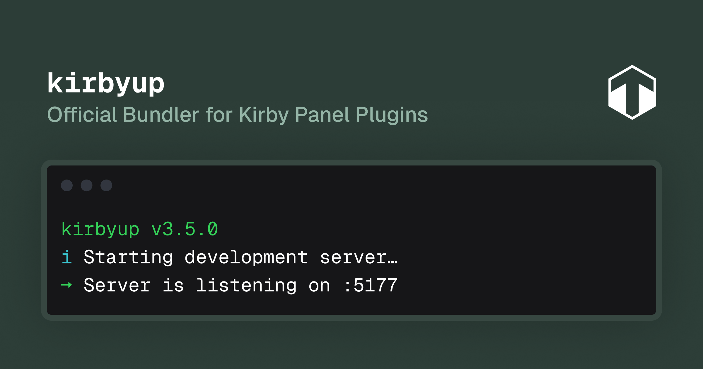

[](https://kirbyup.getkirby.com)

# kirbyup

The official bundler for Kirby Panel plugins. Zero-config, built-in HMR.

- [✨ &nbsp;Release Notes](https://github.com/johannschopplich/kirbyup/releases)
- [📖 &nbsp;Read the documentation](https://kirbyup.getkirby.com)

## Key Features

- 🔄 [Hot Module Replacement](https://kirbyup.getkirby.com/guide/getting-started.html#development)
- 🎒 [PostCSS & Sass](https://kirbyup.getkirby.com/guide/postcss)
- 🧩 [kirbyuse Integration](https://kirbyup.getkirby.com/guide/kirbyuse)
- 🔌 [Environment Variables](https://kirbyup.getkirby.com/guide/environment-variables)
- 🦔 [Configuration File](https://kirbyup.getkirby.com/guide/config-file)
- 🧭 [Path Aliases](https://kirbyup.getkirby.com/guide/path-aliases)

## Requirements

- **Node.js 22 or newer** with pnpm, npm or yarn.
- **Kirby 4 or newer.** kirbyup 3 builds for the Vue 2 Panel of Kirby 4 and 5.

## Setup

> [!TIP]
> Skip the setup with one of the starters:
> - [`eslint`](./examples/eslint)
> - [`unocss`](./examples/unocss)

```bash
# pnpm
pnpm add -D kirbyup

# npm
npm i -D kirbyup

# yarn
yarn add -D kirbyup
```

Add the two scripts to `package.json`:

```json
{
  "scripts": {
    "dev": "kirbyup serve src/index.js",
    "build": "kirbyup src/index.js"
  },
  "devDependencies": {
    "kirbyup": "^3.5.0"
  }
}
```

## Development

1. Clone this repository
2. Enable [Corepack](https://github.com/nodejs/corepack) using `corepack enable`
3. Install dependencies using `pnpm install`
4. Build with `pnpm run build`
5. Run tests with `pnpm test`

## License

[MIT](./LICENSE) License © 2021-PRESENT [Johann Schopplich](https://github.com/johannschopplich)

[MIT](./LICENSE) License © 2022-PRESENT [Jonas Kuske](https://github.com/jonaskuske)
